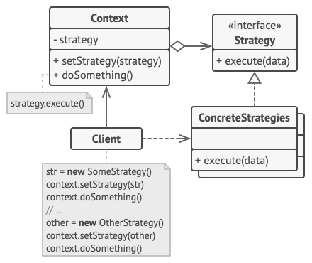

# Strategy design pattern

## Description

The Strategy pattern uses different algorithms to achieve some specific functionality. These algorithms are hidden behind an interface and, of course, they must be interchangeable. All algorithms achieve the same functionality in a different way. For example, we could have a Sort interface and few sorting algorithms. The result is the same, some list is sorted, but we could have used quick sort, merge sort, and so on.

## Objectives
The objectives of the Strategy pattern are really clear. The pattern should do the following:

* Provide a few algorithms to achieve some specific functionality
* All types achieve the same functionality in a different way but the client of the strategy isn't affected
* 
The problem is that this definition covers a huge spectrum of possibilities. This is because Strategy pattern is actually used for a variety of scenarios and many software engineering solutions come with some kind of strategy within. Therefore it's better to see it in action with a real example.

## Structure

